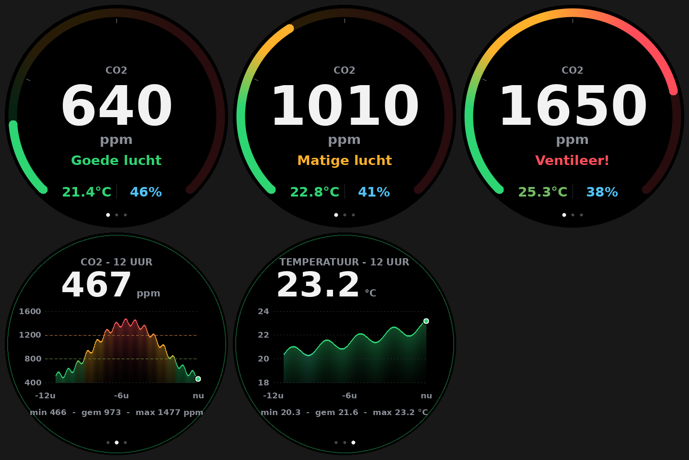

# CO2-meter voor Home Assistant

ESPHome-firmware voor een CO2-meter met ronde AMOLED-display.

## Hardware
- Waveshare ESP32-S3-Touch-AMOLED-1.32 (466x466, CO5300 via QSPI, CST820 touch)
- SCD41-module (CO2, temperatuur, luchtvochtigheid; I2C, 3,3 V)
  - De module met BME280/BME680 uit de advertentie is niet nodig; de SCD41 meet alles zelf.

## Bedrading SCD41
| SCD41 | ESP32-S3 |
|-------|----------|
| VCC   | 3V3      |
| GND   | GND      |
| SDA   | `sensor_sda` (standaard GPIO17) |
| SCL   | `sensor_scl` (standaard GPIO18) |

Gebruik niet de I2C-pinnen van het touchpaneel; die hangen op een aparte bus.

## Belangrijk: pinnen controleren
Ik kon het schema van de 1.32"-variant niet inzien. De display- en touchpinnen in
`co2-meter.yaml` (sectie `substitutions`) zijn gebaseerd op verwante Waveshare-boards en
**moeten** worden gecontroleerd tegen
<https://docs.waveshare.com/ESP32-S3-Touch-AMOLED-1.32>. Heeft het bord een
I/O-expander of aparte display-voeding, dan moet die ook worden aangestuurd.

## Installeren
```bash
cd co2-meter
cp secrets.example.yaml secrets.yaml   # invullen
pip install esphome                    # >= 2025.9 (mipi_spi met CO5300)
esphome run co2-meter.yaml             # eerste keer via USB
```
Home Assistant ontdekt het apparaat automatisch (Instellingen > Apparaten > ESPHome).

## Entiteiten in Home Assistant
CO2, temperatuur, luchtvochtigheid, WiFi-signaal, schermhelderheid, knop
"Kalibreer op 420 ppm" (alleen gebruiken na 3+ min buiten) en herstartknop.

## Gebruik


*(Voorbeeld gerenderd met een mock-display en een ander lettertype; op het apparaat gebruikt de firmware Roboto.)*

- Drie pagina's, wisselen met een tik:
  1. **Overzicht**: 270°-gauge met kleurverloop (groen, amber, rood) en streepjes bij 800 en 1200 ppm, grote CO2-waarde, status, temperatuur in °C en luchtvochtigheid.
  2. **CO2-grafiek**: laatste 12 uur, lijn gekleurd op waarde, drempellijnen, min/gem/max.
  3. **Temperatuurgrafiek**: laatste 12 uur in °C, automatische schaal, min/gem/max.
- Is het scherm gedimd, dan maakt de eerste tik het alleen wakker (30 s volle helderheid, daarna 30%).
- De historie staat in het RAM en begint na een herstart opnieuw (1 punt per 5 min).
- Drempels, kleuren en layout staan in `ui.h`.
- De SCD41 heeft ~5 s opwarmtijd en kalibreert zichzelf (ASC) na enkele dagen frisse lucht.
- Plaats de sensor uit de buurt van de ESP32 en het display (warmte beïnvloedt temperatuur/RV).

## Niet getest
Niet op hardware of met `esphome config` gevalideerd. `ui.h` is wel gecompileerd tegen een mock van de display-API. Onzeker: of `mipi_spi` voor dit bord `set_brightness(uint8_t)` heeft (dimmen); zo niet, haal de `on_state`-regel bij de lamp weg.
